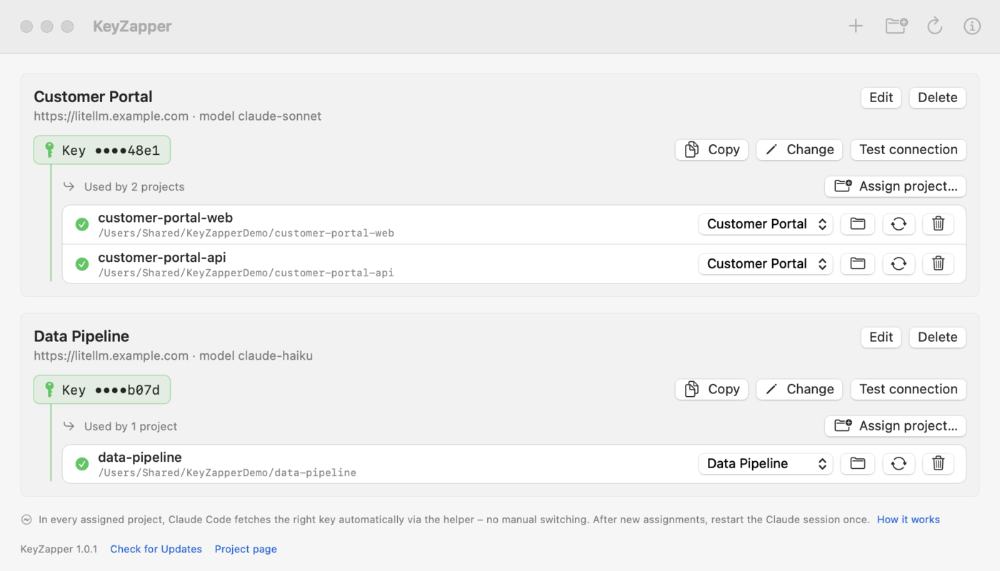

**English** · [Deutsch](README.de.md)


# KeyZapper

macOS app that manages approved, project-specific LiteLLM keys in the Keychain and assigns them to local project folders.
Claude Code (VS Code, IntelliJ, CLI) then automatically uses the matching key in every project. Several projects open at
the same time work independently of each other.

**Assign once, never switch keys again.** Claude Code fetches the matching key itself via `keyzapper-helper`,
even when KeyZapper is closed. The app explains this under “How it works”.



<sub>Screenshot with made-up sample data.</sub>

```
Claude Code ──apiKeyHelper──▶ keyzapper-helper ──▶ macOS Keychain
     │
     └──── requests with project key ────▶ LiteLLM ──▶ Amazon Bedrock
```

## Features

* Profiles with name, LiteLLM endpoint, optional model alias and key. The key is stored exclusively in the Keychain.
* Assign project folders to a profile. The app only adds to `.claude/settings.local.json` and excludes the file from Git via `.git/info/exclude`.
* Status per project: active, differing, folder missing, key missing, conflicts with other settings.
* Test connection against LiteLLM (invalid or blocked key, rate limit, budget, gateway unreachable).
* Removing an assignment only removes the entries the app set itself.
* Overview with all profiles, masked keys and assigned projects. Everything can be changed directly; keys can be copied and replaced.
* Update check against the GitHub releases with one-click installation; the version is shown in the app and under “About KeyZapper”.
* UI in English and German (follows the macOS system language).
* Encrypted backup and restore of profiles, assignments and keys (`.kzbackup`, password-protected).
* Manageable via Intune: predefined profiles, gateway allowlist, defaults, minimum CLI version, OneDrive backup, update check.

## Requirements

* macOS 14 or newer
* Claude Code ≥ 2.1.288 (VS Code extension or the `claude` CLI for IntelliJ). Older versions only read the project assignment
  at startup directly in the project folder; the app warns in that case.

## Usage

1. **Create profile:** name, LiteLLM endpoint, key and optionally the gateway model names for Opus, Sonnet and Haiku. *Load models from gateway* lists the models the key may use (LiteLLM `/v1/models`) and fills the tiers. Profiles managed by IT are already there; just enter the key.
2. **Assign project:** choose a folder and select a profile. For Git repositories the assignment applies to the whole repository
   including subfolders and worktrees. Claude Code reads the project settings only at the root of the main checkout.
3. **Restart the Claude session in the project**; in VS Code, start a new conversation or reload the window.

The overview shows every profile with endpoint, model and the assigned key (masked, e.g. `••••7f3a`) along with all
assigned projects. For each project you can change the profile, reapply the settings and remove the assignment.

**Copy key:** The key is placed on the clipboard marked as confidential so that clipboard managers do not store it.
After 60 seconds it is removed again, unless something else has been copied in the meantime.

**Changing a key:** “Change” replaces the key; this takes effect immediately for new sessions. Running sessions pick up the key after the
helper cache expires (default 5 min), after an HTTP 401, or after a restart.

**If a key is missing** or blocked, requests fail. Claude Code never falls back to other credentials.

## How it works

**Setup (once):** The key goes to the helper via stdin and ends up only in the Keychain. The app writes only references into the project.


**Runtime (every Claude request):** Claude Code fetches the key for each project itself via the helper, even when the app is closed.


The full view with explanations is at [docs/diagrams/keyzapper-flow.html](docs/diagrams/keyzapper-flow.html).

The app writes to `<project>/.claude/settings.local.json`:

| Key | Value |
|---|---|
| `apiKeyHelper` | `'/Applications/KeyZapper.app/Contents/Helpers/keyzapper-helper' credential --profile <UUID>` |
| `env.ANTHROPIC_BASE_URL` | LiteLLM endpoint of the profile |
| `env.ANTHROPIC_DEFAULT_OPUS_MODEL`, `…_SONNET_MODEL`, `…_HAIKU_MODEL`, `env.ANTHROPIC_MODEL` | Gateway model names of the profile (if set), e.g. `eu.anthropic.claude-sonnet-5-…` |
| further `env.*` | Additional environment variables of the profile, e.g. `CLAUDE_CODE_DISABLE_EXPERIMENTAL_BETAS=1` for Bedrock via LiteLLM |
| `env.ANTHROPIC_API_KEY`, `env.ANTHROPIC_AUTH_TOKEN` | `""`. This neutralizes inherited values from the IDE or shell that would otherwise produce mixed auth headers. |

Existing settings are preserved. Changes are atomic and idempotent: setting up repeatedly changes nothing.

Conflicts that prevent setup:
* Managed Claude settings that set `apiKeyHelper` or `ANTHROPIC_*`
* `CLAUDE_CODE_USE_BEDROCK`, `_VERTEX` or `_FOUNDRY` in any settings level
* foreign values for the same keys in `settings.local.json`
* a checked-in `settings.local.json`

**Helper interface:** `keyzapper-helper credential|store|status|delete --profile <UUID>`. The key flows only via stdin and stdout,
never via arguments or logs.

| Exit code | Meaning |
|---|---|
| 0 | ok |
| 64 | usage |
| 65 | unknown profile |
| 66 | key missing |
| 70 | internal |
| 77 | Keychain locked/denied |
| 78 | metadata corrupt or endpoint not in `AllowedGatewayHosts` |

Metadata without keys is stored in `~/Library/Application Support/KeyZapper/state.json`. Measurement results, version matrix and
architecture decision are in [docs/feasibility.md](docs/feasibility.md).

## Distribution via Microsoft Intune

Every Git tag `X.Y.Z` builds the package `KeyZapper-X.Y.Z.pkg` via CI and attaches it to the GitHub release (see [Release](#release)).

**Create the app:** *Apps › All apps › Create › macOS app (PKG)*. This is the unmanaged PKG type, which also accepts
unsigned packages; it requires the Intune Management Agent ≥ 2308.006.
* Minimum OS: macOS 14
* Detection rules › Included apps: `io.github.bl0rb.keyzapper` with the package version, “Ignore app version” = No

**Signing:** With a Developer ID signature (`SIGN_IDENTITY`, `INSTALLER_IDENTITY`) and notarization, Keychain access
is preserved across updates. With ad-hoc-signed builds, macOS asks once again after every update whether
`keyzapper-helper` may access it.

**Uninstall:** Intune has no uninstall assignment for PKG apps. First choose “Remove assignment” in the app,
then delete `/Applications/KeyZapper.app`.

### Configuration

*Devices › Configuration › Create › macOS › Templates › Preference file*, Preference domain name `io.github.bl0rb.keyzapper`.
Template for the Property list file: [docs/intune/io.github.bl0rb.keyzapper.plist](docs/intune/io.github.bl0rb.keyzapper.plist). It contains only
key-value pairs without the `<plist>`/`<dict>` wrapper, as Intune requires.

| Key | Type | Effect |
|---|---|---|
| `ManagedProfiles` | Array of dicts: `Name`, `Endpoint`, optional `OpusModel`, `SonnetModel`, `HaikuModel`, `ModelAlias`, `Environment` (dict), `ID` | Profiles are created automatically and cannot be edited or deleted; developers only enter the key. Without `ID` the profile ID is derived from `Name`, so renaming creates a new profile. |
| `AllowedGatewayHosts` | Array of strings (`host` or `*.domain`) | Profiles only for these hosts. The helper does not release keys for other hosts (exit 78). Empty means no restriction. |
| `DefaultEndpoint`, `DefaultModelAlias` | String | Prefill when creating your own profiles |
| `MinimumClaudeCodeVersion` | String | Threshold for the warning about outdated Claude CLIs (default 2.1.288) |
| `OneDriveBackup` | Bool | Backup of profiles and assignments to OneDrive (see below) |
| `BackupDirectory` | String, `~` allowed | Explicit backup folder; enables the backup even without `OneDriveBackup` |
| `UpdateCheckEnabled` | Bool (default `true`) | In-app update check. When distributing via Intune, set to `false`, otherwise Intune may overwrite a newer version that was installed by the user. |
| `AllowKeyExport` | Bool (default `true`) | Whether encrypted backups may contain keys. `false`: backups contain profiles and assignments only. |

Test locally (user level; values managed via Intune take precedence):

```bash
defaults write io.github.bl0rb.keyzapper AllowedGatewayHosts -array litellm.firma.example
```

### OneDrive backup

The app backs up profiles and project assignments to `~/Library/CloudStorage/OneDrive-<Company>/KeyZapper/keyzapper-backup.json`.
A business account takes precedence over “OneDrive-Personal”. **Keys are never backed up.** On a new Mac the app offers
to restore or discard the backup (“Restore” or “Discard”). Assignments are only applied for existing folders; the keys
have to be entered again. As long as a found backup has been neither restored nor discarded, it is not overwritten.

## Encrypted backup and restore

*Backup › Export Backup…* (toolbar or *File* menu) writes profiles, project assignments and keys into a `.kzbackup` file,
encrypted with a password of at least 12 characters. *Import Backup…* restores them on the same or another Mac:
profiles and keys with the same ID are overwritten, and projects are assigned if their folder exists. The password is
stored nowhere – without it the backup cannot be restored.

Encryption: AES-256-GCM with a key derived via PBKDF2-HMAC-SHA256 (600,000 iterations, random salt). The file
parameters are authenticated, so a wrong password or a modified file is detected. The file is saved with permissions
`0600`. With `AllowKeyExport = false` the backup contains no keys. Unlike the automatic OneDrive backup (never keys),
this backup is created manually and on demand.

## Updates and version

On startup the app checks the latest [GitHub release](https://github.com/bl0rb/ClaudeKeyZapper/releases); you can also check manually via
*KeyZapper › Check for Updates…* or the version line at the bottom of the app. If a newer version is available, “Install”
downloads the `.pkg`, verifies the SHA-256 checksum published by GitHub, and opens the macOS installer.
Administrator rights are required. Packages are only downloaded from `github.com`. The installed version is shown at the bottom of the
app and under *KeyZapper › About KeyZapper*.

With Intune, `UpdateCheckEnabled = false` turns the check off. Updates then arrive as a new package in Intune.

## Known limitations

* One profile per Git repository; subfolders and worktrees cannot be assigned differently.
* If Claude is started outside the assigned area (e.g. in a subfolder of a non-Git folder), it uses the
  developer's default sign-in.
* The IntelliJ integration has not yet been verified in the pilot.

## Development

```
Sources/KeyZapperCore   Data model, metadata, Keychain, helper logic, Claude settings, Intune configuration, backup
Sources/KeyHelper       keyzapper-helper (apiKeyHelper for Claude Code; the only process with Keychain access)
Sources/KeyZapperApp    SwiftUI interface
spike/                  Integration prototype with mock gateway (run_spike.sh)
scripts/                build-app.sh, build-pkg.sh, make-icon.sh
```

Tests:

```bash
swift test
```

End-to-end with the real Keychain, helper and Claude Code against a local mock gateway. It uses only `sk-test-*` keys
and cleans up afterwards:

```bash
KEYZAPPER_E2E_CLAUDE="$(which claude)" swift test --filter EndToEnd
```

Build the app bundle (`dist/KeyZapper.app`) and package (`dist/KeyZapper-<version>.pkg`) locally:

```bash
VERSION=1.0.0 scripts/build-pkg.sh
```

The icon is regenerated from [Resources/AppIcon.svg](Resources/AppIcon.svg) with `scripts/make-icon.sh`.

## Release

A tag in the format `X.Y.Z` starts [.github/workflows/release.yml](.github/workflows/release.yml). The workflow runs the
tests, builds `KeyZapper-X.Y.Z.pkg` (`CFBundleShortVersionString` = tag) and publishes it as a GitHub release.

```bash
git tag 1.0.0
```

```bash
git push origin 1.0.0
```

## License

[MIT](LICENSE) © 2026 bl0rb
