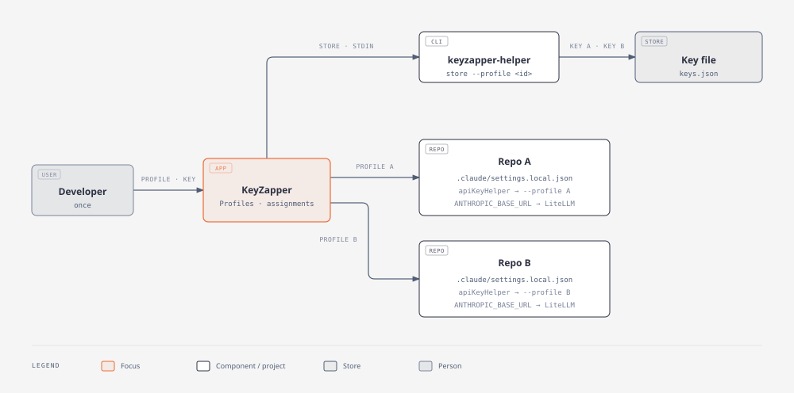
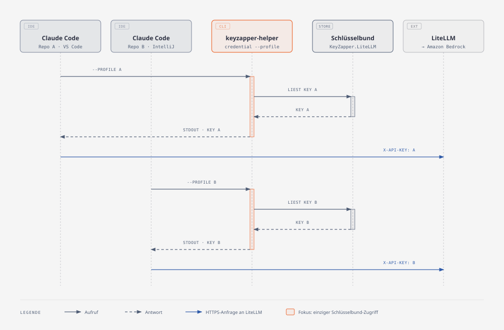

# KeyZapper

macOS-App, die freigegebene, projektbezogene LiteLLM-Keys im Schlüsselbund verwaltet und lokalen Projektordnern zuordnet.
Claude Code (VS Code, IntelliJ, CLI) verwendet danach in jedem Projekt automatisch den passenden Key. Mehrere gleichzeitig
offene Projekte arbeiten unabhängig voneinander.

```
Claude Code ──apiKeyHelper──▶ keyzapper-helper ──▶ macOS-Schlüsselbund
     │
     └──── Anfragen mit Projekt-Key ────▶ LiteLLM ──▶ Amazon Bedrock
```

## Funktionen

* Profile mit Name, LiteLLM-Endpunkt, optionalem Modellalias und Key. Der Key liegt ausschließlich im Schlüsselbund.
* Projektordner einem Profil zuordnen. Die App ergänzt nur `.claude/settings.local.json` und schließt die Datei per `.git/info/exclude` von Git aus.
* Status je Projekt: aktiv, abweichend, Ordner fehlt, Key fehlt, Konflikte mit anderen Einstellungen.
* Verbindungstest gegen LiteLLM (ungültiger oder gesperrter Key, Rate-Limit, Budget, Gateway nicht erreichbar).
* Rücknahme entfernt nur die Einträge, die die App selbst gesetzt hat.
* Steuerbar per Intune: vorgegebene Profile, Gateway-Allowlist, Standardwerte, CLI-Mindestversion, OneDrive-Backup.

## Voraussetzungen

* macOS 14 oder neuer
* Claude Code ≥ 2.1.288 (VS-Code-Erweiterung bzw. `claude`-CLI für IntelliJ). Ältere Versionen lesen die Projektzuordnung
  nur beim Start direkt im Projektordner; die App warnt in dem Fall.

## Nutzung

1. **Profil anlegen:** Name, LiteLLM-Endpunkt, optional Modellalias, Key. Von der IT vorgegebene Profile sind bereits da; dort nur den Key eintragen.
2. **Projekt zuordnen:** Ordner wählen und Profil auswählen. Bei Git-Repositories gilt die Zuordnung für das ganze Repository
   samt Unterordnern und Worktrees. Claude Code liest die Projekteinstellungen nur am Root des Haupt-Checkouts.
3. **Claude-Sitzung im Projekt neu starten**, in VS Code eine neue Unterhaltung bzw. das Fenster neu laden.

**Keywechsel:** „Key ersetzen“ wirkt sofort für neue Sitzungen. Laufende Sitzungen übernehmen den Key nach Ablauf des
Helper-Caches (Standard 5 min), nach einem HTTP 401 oder nach einem Neustart.

**Fehlt ein Key** oder ist er gesperrt, schlagen die Anfragen fehl. Claude Code weicht nie auf andere Zugangsdaten aus.

## So funktioniert es

**Einrichtung (einmalig):** Der Key geht per stdin an den Helper und landet nur im Schlüsselbund. Ins Projekt schreibt die App nur Verweise.



**Laufzeit (jede Claude-Anfrage):** Claude Code holt den Key pro Projekt selbst über den Helper, auch wenn die App geschlossen ist.



Die Gesamtansicht mit Erläuterungen liegt unter [docs/diagrams/keyzapper-flow.html](docs/diagrams/keyzapper-flow.html).

Die App schreibt in `<Projekt>/.claude/settings.local.json`:

| Schlüssel | Wert |
|---|---|
| `apiKeyHelper` | `'/Applications/KeyZapper.app/Contents/Helpers/keyzapper-helper' credential --profile <UUID>` |
| `env.ANTHROPIC_BASE_URL` | LiteLLM-Endpunkt des Profils |
| `env.ANTHROPIC_MODEL` | Modellalias (falls gesetzt) |
| `env.ANTHROPIC_API_KEY`, `env.ANTHROPIC_AUTH_TOKEN` | `""`. Das neutralisiert geerbte Werte aus IDE oder Shell, die sonst gemischte Auth-Header erzeugen. |

Bestehende Einstellungen bleiben erhalten. Änderungen sind atomar und idempotent: Wiederholtes Einrichten ändert nichts.

Konflikte, die das Einrichten verhindern:
* Verwaltete Claude-Einstellungen, die `apiKeyHelper` oder `ANTHROPIC_*` setzen
* `CLAUDE_CODE_USE_BEDROCK`, `_VERTEX` oder `_FOUNDRY` in einer Einstellungsebene
* fremde Werte für dieselben Schlüssel in `settings.local.json`
* eine eingecheckte `settings.local.json`

**Helper-Schnittstelle:** `keyzapper-helper credential|store|status|delete --profile <UUID>`. Der Key fließt nur über stdin und stdout,
nie über Argumente oder Logs.

| Exit-Code | Bedeutung |
|---|---|
| 0 | ok |
| 64 | Aufruf |
| 65 | unbekanntes Profil |
| 66 | Key fehlt |
| 70 | intern |
| 77 | Schlüsselbund gesperrt/verweigert |
| 78 | Metadaten defekt oder Endpunkt nicht in `AllowedGatewayHosts` |

Metadaten ohne Keys liegen in `~/Library/Application Support/KeyZapper/state.json`. Messergebnisse, Versionsmatrix und
Architekturentscheidung stehen in [docs/feasibility.md](docs/feasibility.md).

## Verteilung über Microsoft Intune

Jeder Git-Tag `X.Y.Z` baut per CI das Paket `KeyZapper-X.Y.Z.pkg` und hängt es an das GitHub-Release (siehe [Release](#release)).

**App anlegen:** *Apps › Alle Apps › Erstellen › macOS-App (PKG)*. Das ist der nicht verwaltete PKG-Typ, der auch
unsignierte Pakete annimmt; Voraussetzung ist der Intune Management Agent ≥ 2308.006.
* Mindest-OS: macOS 14
* Erkennungsregeln › Enthaltene Apps: `io.github.bl0rb.keyzapper` mit der Paketversion, „App-Version ignorieren“ = Nein

**Signatur:** Mit einer Developer-ID-Signatur (`SIGN_IDENTITY`, `INSTALLER_IDENTITY`) und Notarisierung bleibt der Zugriff
auf den Schlüsselbund über Updates hinweg erhalten. Bei ad-hoc-signierten Builds fragt macOS nach jedem Update einmal neu,
ob `keyzapper-helper` zugreifen darf.

**Deinstallation:** Intune kennt für PKG-Apps keine Deinstallationszuweisung. Vorher in der App „Zuordnung entfernen“
wählen, dann `/Applications/KeyZapper.app` löschen.

### Konfiguration

*Geräte › Konfiguration › Erstellen › macOS › Vorlagen › Einstellungsdatei (Preference file)*, Domäne `io.github.bl0rb.keyzapper`.
Vorlage: [docs/intune/io.github.bl0rb.keyzapper.plist](docs/intune/io.github.bl0rb.keyzapper.plist). Sie enthält nur
Schlüssel-Wert-Paare ohne `<plist>`/`<dict>`-Rahmen, wie Intune es verlangt.

| Schlüssel | Typ | Wirkung |
|---|---|---|
| `ManagedProfiles` | Array von Dicts: `Name`, `Endpoint`, optional `ModelAlias`, optional `ID` | Profile werden automatisch angelegt und sind nicht editier- oder löschbar; Entwickler tragen nur den Key ein. Ohne `ID` wird die Profil-ID aus `Name` abgeleitet, eine Umbenennung erzeugt also ein neues Profil. |
| `AllowedGatewayHosts` | Array von Strings (`host` oder `*.domain`) | Profile nur für diese Hosts. Der Helper gibt Keys für andere Hosts nicht heraus (Exit 78). Leer bedeutet keine Einschränkung. |
| `DefaultEndpoint`, `DefaultModelAlias` | String | Vorbelegung beim Anlegen eigener Profile |
| `MinimumClaudeCodeVersion` | String | Schwelle für die Warnung vor veralteten Claude-CLIs (Standard 2.1.288) |
| `OneDriveBackup` | Bool | Backup von Profilen und Zuordnungen nach OneDrive (siehe unten) |
| `BackupDirectory` | String, `~` erlaubt | Expliziter Backup-Ordner; aktiviert das Backup auch ohne `OneDriveBackup` |

Lokal testen (Benutzerebene; per Intune verwaltete Werte haben Vorrang):

```bash
defaults write io.github.bl0rb.keyzapper AllowedGatewayHosts -array litellm.firma.example
```

### OneDrive-Backup

Die App sichert Profile und Projektzuordnungen nach `~/Library/CloudStorage/OneDrive-<Firma>/KeyZapper/keyzapper-backup.json`.
Ein Geschäftskonto hat Vorrang vor „OneDrive-Personal“. **Keys werden nie gesichert.** Auf einem neuen Mac bietet die App
an, das Backup wiederherzustellen oder zu verwerfen. Zuordnungen werden nur für vorhandene Ordner übernommen, die Keys
trägt man neu ein. Solange ein gefundenes Backup nicht wiederhergestellt oder verworfen wurde, wird es nicht überschrieben.

## Bekannte Einschränkungen

* Ein Profil pro Git-Repository; Unterordner und Worktrees lassen sich nicht abweichend zuordnen.
* Startet Claude außerhalb des zugeordneten Bereichs (z. B. in einem Unterordner eines Nicht-Git-Ordners), nutzt es die
  Standard-Anmeldung des Entwicklers.
* Die IntelliJ-Integration ist noch nicht im Pilot geprüft.

## Entwicklung

```
Sources/KeyZapperCore   Datenmodell, Metadaten, Schlüsselbund, Helper-Logik, Claude-Einstellungen, Intune-Konfiguration, Backup
Sources/KeyHelper       keyzapper-helper (apiKeyHelper für Claude Code; einziger Prozess mit Schlüsselbundzugriff)
Sources/KeyZapperApp    SwiftUI-Oberfläche
spike/                  Integrationsprototyp mit Mock-Gateway (run_spike.sh)
scripts/                build-app.sh, build-pkg.sh, make-icon.sh
```

Tests:

```bash
swift test
```

End-to-End mit echtem Schlüsselbund, Helper und Claude Code gegen ein lokales Mock-Gateway. Es verwendet nur `sk-test-*`-Keys
und räumt danach auf:

```bash
KEYZAPPER_E2E_CLAUDE="$(which claude)" swift test --filter EndToEnd
```

App-Bundle (`dist/KeyZapper.app`) und Paket (`dist/KeyZapper-<version>.pkg`) lokal bauen:

```bash
VERSION=1.0.0 scripts/build-pkg.sh
```

Das Icon wird aus [Resources/AppIcon.svg](Resources/AppIcon.svg) mit `scripts/make-icon.sh` neu erzeugt.

## Release

Ein Tag im Format `X.Y.Z` startet [.github/workflows/release.yml](.github/workflows/release.yml). Der Workflow führt die
Tests aus, baut `KeyZapper-X.Y.Z.pkg` (`CFBundleShortVersionString` = Tag) und veröffentlicht es als GitHub-Release.

```bash
git tag 1.0.0
```

```bash
git push origin 1.0.0
```
